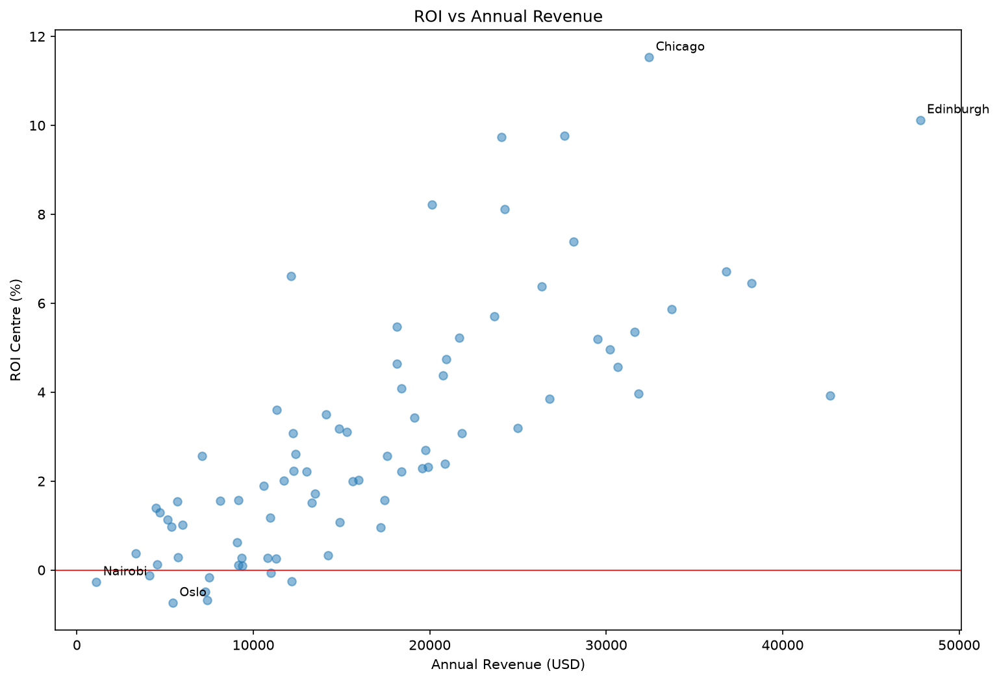
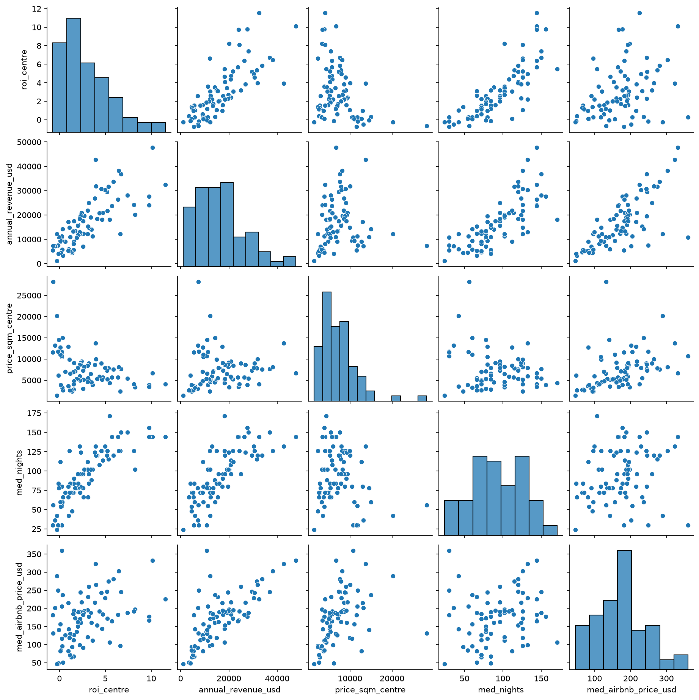
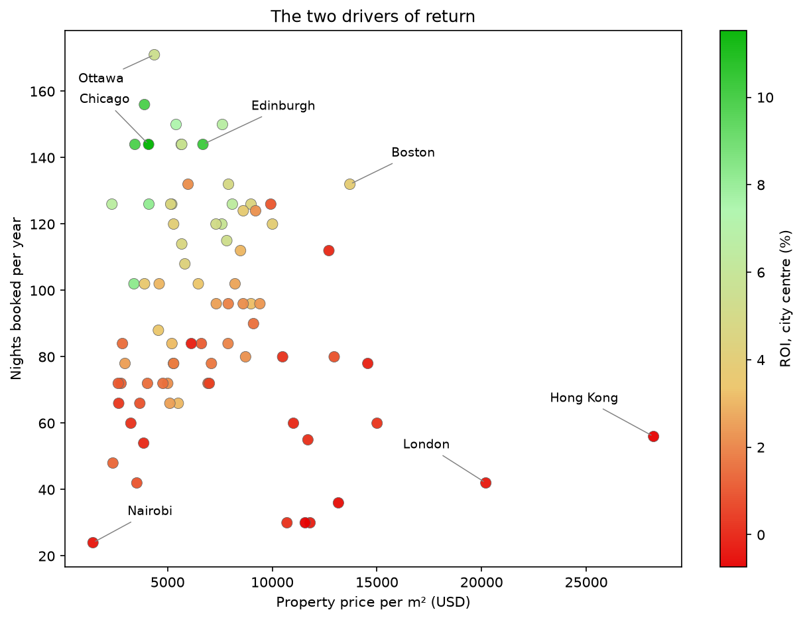
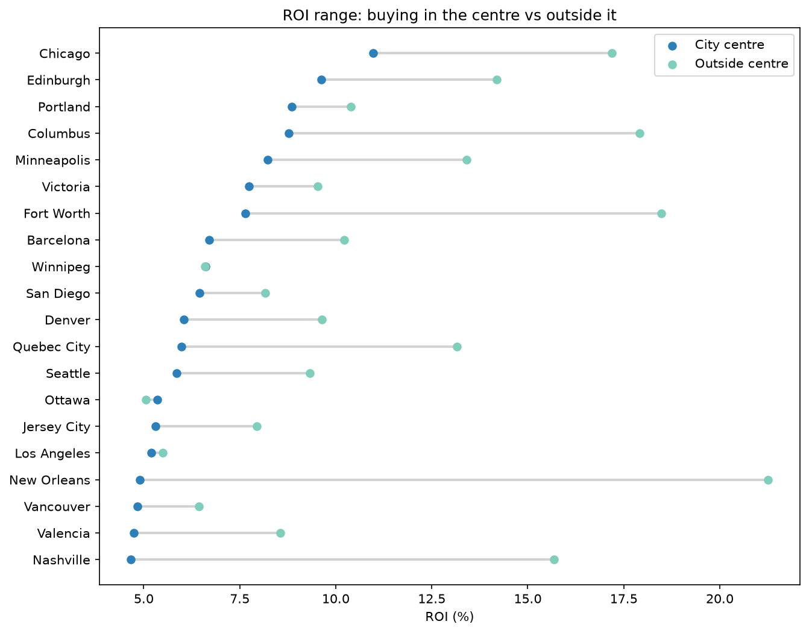

# Short-term Airbnb rental ROI across World Cities

If you bought a 1–2 bedroom apartment and rented it short-term on Airbnb, which cities would give the best return?

---

## Contents

1. **[Executive summary](#executive-summary)**
2. **[Findings](#findings)**
3. **[Method](#method)**
4. **[City selection](#city-selection)**
5. **[Cleaning](#cleaning)**
6. **[Estimating occupancy](#estimating-occupancy)**
7. **[Assumptions](#assumptions)**
8. **[Limitations](#limitations)**
9. **[Extensions](#extensions)**
10. **[Reproducing this](#reproducing-this)**

---

## Executive summary

Across 80 world cities, **Chicago gives the highest return on a city-centre purchase** — 11.5% gross. Buy outside the centre and the leader changes: **New Orleans returns 22.5%**, against Chicago's 18.0%. **Eight cities return less than nothing** in the centre, and three of them (Oslo, Hong Kong, Munich) lose money wherever in the city you buy.

Every city is reported as a **range**, because Numbeo publishes two property prices per city and the gap between them is often wider than the gap between cities.

**Occupancy is the strongest single predictor of return** (correlation 0.81), ahead of revenue (0.77) and well ahead of nightly price (0.36). How often a property is booked matters more than what it charges.

**What a property earns and what it costs are only loosely related** (correlation 0.36). Expensive cities earn somewhat more, but not enough to compensate. Boston earns $42,680 a year and returns 3.9%; Chicago earns $32,426 and returns 11.5%, because Boston property costs 3.3 times as much.

### Read this before the ranking

This is a screening exercise, not investment advice, and four things constrain it:

- **Regulation is not modelled anywhere in this analysis, and in several markets it decides the answer.** New York was excluded outright; Singapore, Amsterdam and London all operate under caps or bans that suppress what the data shows. Chicago illustrates the cost: it requires registration and, in most cases, that the unit be the owner's primary residence — which rules out buying purely to let, and it is the top-ranked city here.
- **All figures are gross of tax.** Chicago carries 27.75% in local lodging taxes, which comes straight off its return. No other city's rate was researched, so the table cannot be reordered on tax. Income tax on rental profit is a separate layer, also unmodelled.
- **Occupancy is estimated, not measured.** Airbnb publishes no booking data. This uses the San Francisco Model, the method Inside Airbnb applies to its own figures.
- **These are not "the world's 80 cities."** Inside Airbnb's coverage is volunteer-maintained. North America, Western Europe and Australia are well covered; Africa, South Asia and the Middle East barely at all.

- **Property cost assumes a fixed 60 m² apartment everywhere.** Changing the constant to another single number barely reorders the table. But real apartment sizes differ by country — roughly 23 m² in Hong Kong against 68–102 m² in the US — and correcting for that would reshuffle the ranking substantially, favouring dense cities and penalising sprawling ones. No source exists to make that correction.

Every one of these gaps is a data limitation rather than something left out by choice. There is no public source for 1–2 bedroom apartment size across 32 countries, no occupancy source that publishes both its denominator and its time window, and no consolidated source for short-term rental regulation or tax by city. Filling them would mean either commercial licences bought country by country, or manual research on a scale that would dwarf the analysis itself. What is here is what free, reproducible data supports.

---

## Findings

| Rank | City | Country | ROI centre | ROI outside | Occupancy | Revenue/yr |
|---|---|---|---|---|---|---|
| 1 | Chicago | US | 11.5% | 18.0% | 39.5% | $32,426 |
| 2 | Edinburgh | UK | 10.1% | 14.9% | 39.5% | $47,787 |
| 3 | Portland, OR | US | 9.8% | 11.5% | 42.7% | $27,648 |
| 4 | Columbus, OH | US | 9.7% | 19.8% | 39.5% | $24,048 |
| 5 | Minneapolis | US | 8.2% | 13.4% | 27.9% | $20,132 |
| 6 | Fort Worth | US | 8.1% | 19.5% | 34.5% | $24,255 |
| 7 | Victoria, BC | Canada | 7.4% | 9.1% | 41.1% | $28,137 |
| 8 | Barcelona | Spain | 6.7% | 10.2% | 41.1% | $36,817 |
| 9 | Winnipeg | Canada | 6.6% | 6.6% | 34.5% | $12,126 |
| 10 | San Diego | US | 6.5% | 8.2% | 34.5% | $38,225 |
| … | | | | | | |
| 25 | Boston | US | 3.9% | 9.4% | 36.2% | $42,680 |

All 80 cities: [`data/reference/results.csv`](data/reference/results.csv)

*These are screening figures. See [Limitations](#limitations) for what they exclude.*

**Ranked by the outside-centre figure the order changes**: New Orleans 22.5%, Columbus 19.8%, Fort Worth 19.5%, Chicago 18.0%. Chicago leads on a central purchase; three US cities beat it in the suburbs.

### Revenue is a poor guide on its own

Revenue is the second strongest predictor after occupancy, and the two are closely tied — revenue is nightly price multiplied by nights booked. But on its own it misleads.

```python
df = duckdb.sql("SELECT * FROM city_metrics").df()
df["med_nights"].corr(df["roi_centre"])                                    # +0.81
df["annual_revenue_usd"].corr(df["roi_centre"])                            # +0.77
df["price_sqm_centre"].corr(df["roi_centre"])                              # -0.36
```

**Between revenue and property price, revenue scores higher because it varies more.** Revenue spreads further across the sample than property price does — 43-fold from Nairobi to Edinburgh, against 19.6-fold for property. ROI is revenue divided by price, so the input that spreads further moves the answer more.

**Why property price scores only −0.36 despite being decisive.**

For a single city, price is decisive: halve the purchase price and the return doubles. What weakens it as a predictor across cities is that it reaches ROI two ways at once, and they oppose each other.

| Route | Effect on ROI |
|---|---|
| Expensive property costs more to buy | pushes ROI **down** |
| Expensive cities also charge more per night (correlation 0.41), so they earn more | pushes ROI **up** |

Boston shows both at work. Its property costs 3.3 times Chicago's, which should sink its return — but it also earns 32% more per year, which pulls it back. Net result: Boston still loses to Chicago, but by less than the property gap alone would suggest.

Occupancy has no such conflict. It correlates **−0.20** with property price, meaning busy cities tend to be the cheaper ones. So high occupancy and low property cost arrive together and both push the return the same way. That is why occupancy scores 0.81 while price scores −0.36.



Because the relationship is only moderate, revenue alone is a poor guide. At around $30,000 in annual revenue, cities return anywhere from 4% to 11% — the difference being entirely what the property cost. Boston and Chicago sit at opposite ends of that spread.

This matters practically. Commercial short-term rental reports (AirDNA, AirROI, Airbtics) rank cities by revenue, because that is the data they hold. If you already own a property, that ranking is the right one. If you are deciding where to buy, it is the wrong one.

Five variables plotted against each other — ROI, revenue, property price, nights booked, and nightly price:



### Expensive cities are expensive at everything

Revenue and property price correlate at 0.36 on the log scale. The raw correlation is 0.074, which looks like independence.

The difference comes from measuring on the wrong scale. Correlation fits a straight line, but ROI is a division — revenue divided by price — and division does not behave in straight lines. Taking logs turns dividing into subtracting, which does. Both variables are also right-skewed, so a few very expensive cities drag a straight-line fit off course.

```python
d["annual_revenue_usd"].corr(d["price_sqm_centre"])                  # 0.074 — misleading
np.log(d["annual_revenue_usd"]).corr(np.log(d["price_sqm_centre"]))  # 0.358 — correct scale
```

Using Numbeo's utilities figure as a rough proxy for local cost level:

| Pair | Raw | Log scale |
|---|---|---|
| Nightly price ↔ utilities | 0.44 | 0.51 |
| Nightly price ↔ property price | 0.41 | 0.59 |
| Property price ↔ utilities | 0.39 | 0.44 |
| Revenue ↔ property price | 0.07 | 0.36 |

Both columns are shown because the choice of scale matters here. Three of the pairs shift modestly between them. The fourth swings from near-zero to moderate, because revenue and property price are the two most skewed variables in the set and a few extreme cities distort the raw measurement. Most cities have property between $1,400 and $10,000/m²; Hong Kong sits at $28,217. On the raw scale that one city carries as much weight as a large part of the rest of the sample. Taking logs brings it back into range, so the measurement reflects all 80 cities rather than a handful of outliers.

Four moderate correlations between four different measures of "how expensive is this city." They point at one underlying factor: costly cities are costly at everything — property, nightly rates and utilities together.

That matters for reading the ranking. Part of what separates a high-ROI city from a low-ROI one is not specific to short-term rentals at all; it is simply that the city is cheap across the board. Anyone looking for markets where short-term letting specifically outperforms should read the ranking with that in mind.

But moderate is not strong, and the deviations are where the ranking is decided. Boston and Chicago earn within 30% of each other while their property prices differ by 3.3 times.

*(Utilities is a stand-in for local cost level because it is the only such variable in the dataset. It has not been validated against income or GDP figures.)*

### Occupancy is the strongest single predictor

Correlation with ROI across all 80 cities:

| Variable | vs ROI centre | vs ROI outside |
|---|---|---|
| **Occupancy (nights booked)** | **+0.81** | **+0.72** |
| Annual revenue | +0.77 | +0.69 |
| Nightly price | +0.36 | +0.32 |
| Property price per m² | −0.36 | −0.29 |
| Revenue ÷ property price | +0.996 | — |

Every correlation is weaker against the outside-centre figure but keeps the same ordering, so nothing here depends on which measure is used. The last row is a sanity check rather than a finding: that ratio is the equation minus the two small cost terms, so it should correlate near-perfectly. It does.

Revenue is nightly price times nights booked, so it seems odd that one of its components beats it. The reason is how each component relates to property price — the number ROI divides by:

| | Correlation with property price |
|---|---|
| Nights booked | **−0.20** |
| Nightly price | **+0.41** |

**Occupancy and property price move in opposite directions.** Expensive cities are booked less, so high occupancy and low property cost tend to arrive together and both push ROI the same way.

**Nightly price and property price move together.** Cities that charge more also cost more, so the two effects partly cancel inside ROI.

Revenue blends a reinforcing component with a cancelling one. Occupancy on its own is purely reinforcing, which is why it edges ahead.



Plotting the two drivers together shows it directly. High-return cities sit top-left — cheap property, high occupancy. The bottom-right corner, where property is expensive and occupancy thin, contains only losses.

The variables also spread differently across the sample:

| Variable | Highest ÷ lowest |
|---|---|
| Property price per m² | 19.6× |
| Nightly price | 7.8× |
| Occupancy | 7.1× |

Occupancy runs from 46.8% at the top to 6.6% in Nairobi — a 7.1-fold range, close to the 7.8-fold range in nightly rates. (Nightly price is not in the findings table above; it is in [`results.csv`](data/reference/results.csv).)

**Among the top twenty specifically, occupancy is narrow** — Portland 42.7%, Victoria 41.1%, Chicago 39.5%, Boston 36.2%, Winnipeg 34.5%.

**There is a floor, and it holds across the whole sample.** Forty-five of the 80 cities book fewer than 100 nights a year. The best of them returns **3.5%** (Antwerp), and no city below that line returns more, however cheap its property. Minneapolis sits just above it at 102 nights and returns 8.2%.

Minneapolis is the exception that shows the threshold. It has the lowest occupancy in the top ten at 27.9% and still ranks fifth, because its property costs $3,396/m². Cheap property can make up for below-average occupancy, but not for poor occupancy. Minneapolis at 27.9% is a few points under the leaders; London at 11.5% and Nairobi at 6.6% are in a different range, and no property price in this sample is low enough to rescue them.

### Cheap property is necessary but not sufficient

Among the twenty cheapest property markets in the sample, occupancy sorts the winners from the rest — but only partly.

**Below roughly 100 nights a year, no cheap city performs.** The best of them returns 2.56%:

| City | Property $/m² | Nights | ROI centre |
|---|---|---|---|
| Nairobi | 1,436 | 24 | −0.27% |
| Bergamo | 3,531 | 42 | 1.01% |
| Cape Town | 2,389 | 48 | 1.39% |
| Thessaloniki | 3,860 | 54 | 0.12% |
| Riga | 3,246 | 60 | 0.29% |
| Bogotá | 2,666 | 66 | 0.38% |
| Rio de Janeiro | 3,675 | 66 | 0.97% |
| Buenos Aires | 2,644 | 72 | 1.13% |
| São Paulo | 2,778 | 72 | 1.30% |
| Athens | 4,040 | 72 | 1.55% |
| Istanbul | 2,967 | 78 | 2.56% |
| Santiago | 2,845 | 84 | 1.54% |

Nairobi has the cheapest property in the entire sample and still loses money, because it books 24 nights a year.

**Above 100 nights, results vary widely** — from 3.60% to 11.53%:

| City | Property $/m² | Nights | ROI centre |
|---|---|---|---|
| Chicago | 4,094 | 144 | 11.53% |
| Portland | 3,896 | 156 | 9.77% |
| Columbus | 3,440 | 144 | 9.74% |
| Minneapolis | 3,396 | 102 | 8.22% |
| Fort Worth | 4,109 | 126 | 8.12% |
| Winnipeg | 2,342 | 126 | 6.61% |
| Ottawa | 4,368 | 171 | 5.47% |
| Mexico City | 3,899 | 102 | 3.60% |

Ottawa books more nights than any city in the sample — 171 a year — and still returns only 5.47%, less than half of Chicago's 11.53% on 144 nights. Their property costs are almost identical ($4,368 against $4,094/m²), so the gap is not about price:

```
Ottawa    171 nights × $106/night = $18,146 a year
Chicago   144 nights × $225/night = $32,426 a year
```

Chicago earns 79% more on comparable property because it charges more than twice as much per night. Clearing the occupancy floor does not guarantee a good return; it only makes one possible.

**The floor holds across the full sample, not just the cheap end.** Of all 80 cities, 45 book fewer than 100 nights and none of them returns above 3.5%. The same threshold appears in the outside-centre figures: among the twenty cheapest on that measure, every city below 100 nights returns under 5.6% and every city above returns over 6.6%.

Nothing in the data explains *why* the break sits near 100 rather than 90 or 110. It is a pattern in 80 cities, not a law.

**A cross-check on the leader.** Ranking cities by position rather than by value — summing each city's rank for cheapest property and highest revenue — puts Chicago first at 24, ahead of Portland (28) and Columbus (29). Eight of that top ten also appear in the ROI top ten. Two methods, one using real values and one using only positions, agree on the answer.

So neither input is sufficient alone. Cheap property with thin occupancy returns nothing — Nairobi has the sample's cheapest property and loses money. Good occupancy with expensive property returns little — Boston books 36.2% of the year, more than Chicago's 39.5% is ahead of most, yet returns 3.9% because its property costs $13,710/m². The cities at the top of this ranking have both, and even among those the spread is threefold.

### Eight cities return less than nothing

| City | Country | ROI centre | ROI outside | Occupancy |
|---|---|---|---|---|
| Oslo | Norway | −0.74% | −0.56% | 8.2% |
| Hong Kong | China | −0.68% | −0.48% | 15.3% |
| Munich | Germany | −0.49% | −0.26% | 9.9% |
| Nairobi | Kenya | −0.27% | 0.17% | 6.6% |
| London | UK | −0.26% | 0.75% | 11.5% |
| Copenhagen | Denmark | −0.16% | 0.17% | 8.2% |
| Bangkok | Thailand | −0.12% | 0.63% | 23.0% |
| Vienna | Austria | −0.07% | 1.22% | 21.4% |

Negative means the property does not cover its own holding costs.

These cities are not suffering from two separate problems. Expensive property and thin occupancy arrive together — that is the −0.20 correlation above, at its extreme. London books 42 nights a year against a legal cap of 90; Hong Kong pairs 15.3% occupancy with $28,217/m² property; Oslo and Munich sit near the top of the price range and the bottom of the occupancy range. Regulation explains part of it, and the rest is that expensive cities tend to have more hotel supply and stricter enforcement.

**Only three lose money wherever you buy.** Oslo, Hong Kong and Munich stay negative outside the centre. The other five turn positive outside it — but only just, at 0.17% to 1.22%, so the difference is between losing a little and earning almost nothing rather than between a bad market and a good one.

All of these figures are before tax, so the real picture in each is worse.

### Mid-sized cities beat capitals

Chicago, Portland, Columbus, Minneapolis, Fort Worth, Winnipeg — none is a global destination, but all book over 100 nights a year on affordable property. Barcelona at rank 8 is the only major tourist capital in the top ten, and it gets there on occupancy (41%) rather than price.

Seven of the top ten are North American, and the fixed 60 m² assumption biases results in that direction. The result may be real, or partly an artifact. See [Limitations](#limitations).

### Where you buy inside a city can matter as much as which city

Columbus runs 9.7% in the centre to 19.8% outside. Fort Worth 8.1% to 19.5%. New Orleans 5.2% to 22.5%. Those gaps are wider than the gap between first and twentieth place.



Countries with at least three cities in the sample, mean gap in percentage points:

| Country | Cities | Mean gap |
|---|---|---|
| United States | 21 | 5.10 |
| Spain | 5 | 3.75 |
| Belgium | 3 | 2.73 |
| Italy | 6 | 2.31 |
| Canada | 7 | 1.83 |
| United Kingdom | 4 | 1.71 |
| Australia | 3 | 1.03 |
| France | 3 | 0.90 |

US metros average three times the UK's gap. Spain sits second, well ahead of Canada, so this is not simply North America versus Europe — it tracks urban form. Cities with expensive cores and cheap sprawl show wide gaps; compact, evenly priced cities show almost none.

---

## Method

```
revenue     = median nightly price (1-2 bed entire homes, USD) × estimated nights booked
utilities   = Numbeo monthly utilities × 12, scaled to apartment size
maintenance = 1% of property value per year
value       = Numbeo price per m² × apartment size

ROI = (revenue − utilities − maintenance) ÷ value
```

Written out in full, with apartment size shown explicitly:

```
ROI = ( (P × N) − (12 × U × S ÷ 85) − (0.01 × M × S) ) ÷ (M × S)

P = median nightly price, USD          M = Numbeo property price per m²
N = estimated nights booked per year   S = apartment size, m² (fixed at 60)
U = Numbeo monthly utilities, USD      85 = Numbeo's reference apartment size
```

The `S ÷ 85` on the utilities term scales Numbeo's quote from its 85 m² reference flat down to the size being modelled.

Three things follow from the algebra, and the limitations section rests on them:

- **Apartment size affects only the revenue term.** It cancels out of utilities — scaling the bill to size and then dividing by size leaves nothing behind — and out of maintenance.
- **Maintenance is always exactly 1 percentage point.** It is 1% of property value divided by property value, so it shifts every city equally and changes no rankings.
- **Utilities are independent of the size assumption**, for the same cancellation reason.

In SQL:

```sql
ROUND(100.0 * (
      (med_price_usd * med_nights)          -- revenue
    - (12 * price_utilities * 60 / 85)      -- utilities, scaled to 60 m²
    - (0.01 * price_sqm * 60)               -- maintenance, 1% of value
  ) / (price_sqm * 60), 2) AS roi           -- divided by property value
```

### Data sources

| Source | Used for | Notes |
|---|---|---|
| Inside Airbnb | Listings, prices, review counts | Snapshots 2026-06-14 to 06-30, 123 cities |
| Numbeo | Property price per m², utilities | Centre, outside centre, utilities. USD |
| Frankfurter (ECB) | 29 currencies | Pinned to 2026-06-30 |
| National central banks | 5 currencies the ECB omits | Colombia, Argentina, Chile, Kenya, Taiwan |

All free and public, so the analysis is reproducible.

### Why DuckDB

It queries CSV and gzipped CSV directly with SQL, accepts wildcards across files, needs no server, and handles data larger than memory. Reading 84 gzipped city files as one table is a single line:

```sql
FROM read_csv_auto('data/detailed/*.csv.gz', filename = true, union_by_name = true)
```

`filename = true` keeps the source path so the city can be recovered from it. `union_by_name = true` aligns columns across files with differing schemas. The pandas version would be a loop over 84 files.

---

## City selection

| Filter | Removed | Remaining |
|---|---|---|
| Downloaded from Inside Airbnb | — | 123 |
| Corrupt price data (Switzerland) | 3 | 120 |
| Regions and islands with no single property price | 24 | 96 |
| No Numbeo entry | 5 | 91 |
| New York City | 1 | 90 |
| Fewer than 500 priced 1–2 bed entire homes | 10 | **80** |

**Switzerland.** Zurich, Geneva and Vaud contain three distinct price values between them: `0`, `1`, and `NULL`. Every other city has at least 198 distinct prices; Budapest has 7,481.

```sql
SELECT city, COUNT(DISTINCT price) AS n_distinct_prices
FROM read_csv_auto('data/*.csv', filename = true, union_by_name = true)
GROUP BY 1 ORDER BY n_distinct_prices
```

A city with thousands of listings should have hundreds of distinct prices, because hosts set them independently. Counting distinct values catches corruption without needing to guess what it looks like — an earlier attempt searching for prices of 0 or 1 would have missed a file full of 5s.

Dropping Switzerland removes the top of the global price range: Zug held the highest price per m² in the whole Numbeo table.

**Regions and islands.** New Zealand, Sicily, Hawaii, Puglia, the South Aegean, Ireland, Crete, Mallorca and others contain many separate housing markets. Palermo and Taormina cannot share one price per m².

The test is not whether a file is a city in the administrative sense, but whether the Airbnb file and the Numbeo entry describe the same housing market. Numbeo prices metros, not municipal boundaries, so county-level files can be valid matches:

- **Clark County, NV** — kept. Its neighbourhoods are Unincorporated Areas, Las Vegas, Henderson, North Las Vegas. That is the Las Vegas metro.
- **Los Angeles County** — kept. Its neighbourhood list returned Long Beach (1,856 listings), Santa Monica (1,229), Pasadena (805), Beverly Hills (791) and Glendale (722) alongside Hollywood and Venice. Those are separate municipalities, but they form one continuous metropolitan housing market. Numbeo is assumed to price at that level; it does not publish its boundary definitions, so this could not be confirmed.
- **Girona** — dropped. It sounds like a city, but Girona city accounts for only 2.8% of the file's listings. The rest are Costa Brava resort towns: Roses (2,485 listings), Lloret de Mar (1,715), Castelló d'Empúries (1,485), L'Escala (1,318), Tossa de Mar (810). A resort market cannot be priced with an inland provincial capital's property prices.

Two groups of files were checked this way: every file whose name contained a county, region or metro word (`clark-county-nv`, `broward-county`, `santa-clara-county`, `san-mateo-county`, `santa-cruz-county`, `twin-cities-msa`, `greater-manchester`, `los-angeles`), and every file that failed the Numbeo name join, since a failure often meant the file was not a city at all. Each was opened, its neighbourhood list read, and a decision recorded: keep it as a metro, map it to a city name, or drop it as a region.

Files with unambiguous city names — paris, berlin, tokyo — were not checked. That is an assumption: a file called `paris` was taken to contain Paris.

```sql
SELECT neighbourhood, COUNT(*) AS n
FROM read_csv_auto('data/girona.csv')
GROUP BY 1 ORDER BY n DESC LIMIT 15
```

**No Numbeo entry.** Newark, Asheville, Venice, San Mateo County and Santa Cruz County have Airbnb listings but no Numbeo property price, so the cost side of the equation is missing and no ROI can be computed.

**New York City.** Its median `minimum_nights` is 30, an order of magnitude above every other city. Local Law 18 requires hosts to be present and registered for stays under 30 days, so what remains on Airbnb there is monthly letting — a different product.

**Sample size.** Below roughly 500 listings a city median becomes unstable. The threshold is applied to priced 1–2 bedroom entire homes.

**Name matching.** Airbnb filenames (`paris`) do not match Numbeo's format (`Paris, France`). A derived key handles most cities; twelve needed a hand-written mapping, published in [`data/reference/city_lookup.csv`](data/reference/city_lookup.csv). Duplicate names were caught by row count — 113 cities returned 115 rows after the join, which flagged `london` and `vancouver` each matching two countries.

---

## Cleaning

1. Drop inactive listings (`number_of_reviews_ltm = 0`)
2. Keep entire homes (`room_type = 'Entire home/apt'`)
3. Keep 1–2 bedrooms (`bedrooms <= 2`)
4. Trim prices to each city's 1st–99th percentile
5. Drop cities with fewer than 500 surviving listings
6. Convert to USD (rates pinned to 2026-06-30)

### Listings with no price

Between 0.2% and 28.1% of listings per city have no recorded price. They cannot enter a median, so they were always going to be excluded. The question is whether excluding them biases what remains.

If the unpriced listings were the busy ones, every city median would describe only the slow half of its market. Review counts test that directly:

```sql
SELECT city,
    AVG(CASE WHEN price IS NOT NULL THEN number_of_reviews_ltm END) AS reviews_priced,
    AVG(CASE WHEN price IS NULL     THEN number_of_reviews_ltm END) AS reviews_null,
    SUM(CASE WHEN price IS NULL THEN 1 ELSE 0 END) AS n_null
FROM listings
WHERE room_type = 'Entire home/apt' AND number_of_reviews_ltm > 0 AND bedrooms <= 2
GROUP BY city
```

**In 75 of 80 cities, unpriced listings are far less booked.** Boston 21.2 reviews against 3.9. Amsterdam 10.5 against 4.3. What is lost was barely operating.

**Five cities go the other way, and one of them matters:**

| City | Reviews, priced | Reviews, unpriced | Unpriced listings |
|---|---|---|---|
| Quebec City | 26.2 | 27.1 | 15 |
| **Porto** | **19.5** | **20.5** | **535** |
| Athens | 18.8 | 19.2 | 20 |
| Bogotá | 15.9 | 16.9 | 45 |
| Nairobi | 8.2 | 8.8 | 21 |

Four involve 15 to 45 listings — noise. Porto loses 535, and they are the busier half of its market. Its median nightly price therefore describes its slower listings, and its 1.89% ROI is probably understated. By how much cannot be known: the excluded listings have no price by definition.

### The 1–2 bedroom filter

Inside Airbnb publishes two files per city: a summary file with 16 columns and a detailed file with 75. The summary files have no `bedrooms` column, so an initial pass took the median across all entire homes — studios and six-bedroom houses alike — while costing a 60 m² apartment. The two halves of the equation described different properties.

The detailed files were downloaded and the filter applied. In Paris, 78% of entire homes were already 1–2 bedroom, so the correction is smaller than it sounds — but it is a correction rather than an assumption.

`bedrooms` is optional for hosts and missing for a median of 6% of active listings per city, worst case 18.5%. Those listings are dropped.

### Currency

Airbnb publishes local currency — Bogotá 179,900, Tokyo 20,700, Paris 212 — so conversion comes before any comparison. Snapshots span 16 days, so all rates are pinned to 2026-06-30.

29 currencies come from the ECB. Five are not published by the ECB and were sourced individually:

| Currency | Country | Rate per USD | Source |
|---|---|---|---|
| COP | Colombia | 3,443.59 | TRM, Superintendencia Financiera |
| ARS | Argentina | 1,450.00 | Official rate, BCRA |
| CLP | Chile | 922.34 | Dólar observado, Banco Central de Chile |
| KES | Kenya | 129.41 | June 2026 monthly average |
| TWD | Taiwan | 31.85 | US Federal Reserve H.10 |

---

## Estimating occupancy

Airbnb publishes no booking data. This uses the **San Francisco Model**, the method Inside Airbnb applies to its own published figures:

```
bookings = reviews_ltm ÷ 0.5              50% of guests leave a review
stay     = MAX(3, minimum_nights)         3 nights, or the listing's minimum if higher
nights   = bookings × stay
nights   = MIN(nights, 255)               capped at 70% of the year
```

```sql
LEAST(
    (number_of_reviews_ltm / 0.5) * GREATEST(3, minimum_nights),
    255
) AS nights_booked
```

`GREATEST(3, x)` returns the larger of the two per listing; `LEAST(x, 255)` returns the smaller.

The review rate and three-night default are Inside Airbnb's published values, not choices made here. Both apply identically to every city, so they scale every result equally and do not affect the ranking — only the absolute percentages. What varies per city is the review count, which is observed.

### Why not the availability column?

`availability_365` looks like a more direct measure. It isn't, for two reasons.

**Unavailable is not the same as booked.** A beach house listed only in July and August shows 60 available days, which reads as 305 nights booked when the truth is near zero. A host who opens a rolling three-month window looks dormant while operating normally.

**The two columns cover different years.** `availability_365` is forward-looking — days open in the year *after* the scrape. `number_of_reviews_ltm` is backward-looking. They cannot be compared. This is why availability appears nowhere in the ROI calculation.

### The cap

The 70% ceiling rewrites any individual listing estimated above 255 nights down to exactly 255. Edinburgh is the worst affected, with 29.1% of its listings rewritten this way.

**No city's median comes close to the ceiling.** The highest median occupancy in the sample is 46.8%. Capping only moves listings that were already above the midpoint, and never more than half of them, so the median is untouched. The cap prevents individual absurdities — review counts implying more nights than a year contains — without changing any reported figure.

### Marginal listings

21.5% of active entire-home listings have only 1–2 reviews in twelve months, implying 3 to 12 nights booked all year. They enter the city median with the same weight as a listing booked forty times.

This is why the occupancy figures look low. The highest median in the sample is 46.8% and most cities sit near 30% — well under what a professionally run listing achieves. The median describes the typical listing in a market, and in most markets the typical listing is a spare flat let out a few weekends a year. It is the right number for comparing cities and the wrong one for estimating what a serious operator would book.

### Validation

Three commercial providers publish occupancy for cities in this sample:

| Source | Edinburgh occupancy | Denominator stated? |
|---|---|---|
| This analysis | 39.5% (144 of 365 nights) | yes — calendar nights |
| AirROI | 57.3% | no |
| AirDNA | 63% "of nights available" | partially |
| Airbtics | 84% | no |

**The gap is large and unresolved.** Part of it is definitional — AirDNA measures booked nights as a share of nights *available* rather than of the calendar, which mechanically produces a higher figure — but only AirDNA states its denominator at all, and even there the time window is unclear.

It is not possible to say whether this estimate is low, the commercial figures are high, or the three are measuring incompatible things. The occupancy numbers here are internally consistent and externally unvalidated.

**Commercial providers also disagree with each other**: Edinburgh is published at 57.3%, 63% and 84%, a 27-point spread for the same city in the same year.

**Nightly rates do line up.** Edinburgh: $332 here against AirROI's $311 and AirDNA's $283. Slightly above both is what a 1–2 bedroom entire-home filter should produce. Chicago: $225 here against $171, $247 and $270.

**One check that works.** Amsterdam's estimated occupancy is **exactly 30 nights a year**, and Amsterdam law caps private holiday rentals at **30 nights**. The estimate uses nothing but each listing's review count, doubled to convert reviews into stays and multiplied by three nights per stay, with the median taken across the city. No regulation, no location, no external input. Landing on a legal ceiling it was never told about is the strongest evidence here that the method tracks something real.

---

## Assumptions

| Assumption | Value | Basis |
|---|---|---|
| Apartment size | 60 m², all cities | No source covers 1–2 bed apartment size across 80 cities |
| Review rate | 50% of guests | Inside Airbnb published methodology |
| Default stay | 3 nights, or `minimum_nights` if higher | Inside Airbnb published methodology |
| Occupancy ceiling | 70% of the year | Inside Airbnb published methodology |
| Maintenance | 1% of property value per year | Standard rule of thumb |
| Utilities | Numbeo quote, scaled from 85 m² | Numbeo's convention |
| Taxes | Excluded | Vary by jurisdiction |
| Regulation | Not modelled | Varies by city; decisive in several |
| Market boundaries | Airbnb file and Numbeo entry cover the same housing market | Numbeo does not publish its metro definitions, so this cannot be verified |

---

## Limitations

### 1. Fixed apartment size

Real 1–2 bedroom apartments vary: roughly 23 m² in Hong Kong, 32 m² in Paris, 68–102 m² in the US. Since `S` is a chosen constant rather than a measurement, the distortion is exact algebra. To correct any city's figure:

```
true ROI = computed ROI × (60 ÷ S_true)
```

Worked through: a US city whose real apartments are 90 m² and whose published figure is 10.0% has a true return of 10.0 × (60÷90) = **6.7%**. A Paris flat at 32 m² with a published 3.0% has a true return of 3.0 × (60÷32) = **5.6%**.

Large apartments mean the published figure is too high; small ones mean it is too low. Because the correction differs by country it reshuffles the ranking, favouring large-dwelling countries and penalising dense European and Asian cities.

**Tested.** The analysis was rerun with 85 m². The revenue term shrinks because its denominator grows, while utilities and maintenance do not move at all — so a different constant does not simply rescale every city by the same amount.

| | Result |
|---|---|
| Average rank change | **1.21 places** |
| Largest rank change | 11 places (Riga, Latvia) |
| Largest change in the top 20 | **1 place** |

Every figure falls by roughly a third, and the order moves by 1.21 places on average. **The absolute ROI numbers depend heavily on which constant you pick; the ranking is largely insensitive to it.** Not entirely — a rank change of one or two places is common — but no city moves far.

**Riga's 11-place shift has a cause.** When the assumed apartment size rises from 60 m² to 85 m², the first term of the ROI equation — revenue divided by property value — shrinks by 29%, because the value in its denominator grows. Revenue itself does not change; nightly price and nights booked have nothing to do with floor area. The utilities term does not move either, since size cancels out of it. Cities where utilities eat a large share of the return therefore lose proportionally more. Riga's utilities cost 1.66 percentage points of ROI against a total return of 0.29% — the worst ratio in the sample. The crowding at that end amplifies it: ranks 60 to 77 span 0.97% down to −0.49%, so a few tenths of a point crosses eleven places.

**Not tested: per-country size variation.** Correcting for the fact that American apartments really are larger than Parisian ones needs a consistent measure across 32 countries. It does not exist:

- **Eurostat** publishes average dwelling size but combines houses and flats. Its city-level series covers EU capitals only, in 20 m² bands.
- **National statistics offices** use incompatible definitions — published compilations warn that France, Germany and Spain report on different bases, and that sources mix mean with median and all-stock with new-build.
- **Commercial vendors** are national. Casafari covers 20+ countries but is Europe-weighted and enterprise-priced; ATTOM, RentCast and Zillow are US-only.

Assembling 32 national figures would add a new unmeasured error — differences in measurement convention — to fix a known and quantified one. Four searches across two working sessions returned the same result. This is a gap in public data, not in the search.

### 2. Uneven sample loss

Active listings without a price cannot enter a median, and the share lost varies by city:

| City | Active listings excluded |
|---|---|
| Copenhagen | 27.5% |
| Amsterdam | 22.6% |
| Paris | 16.5% |
| London | 12.8% |
| São Paulo | ~1% |

The pattern is geographic — Western and Northern Europe lose far more than Latin America. Copenhagen's median rests on a smaller and less certain sample than São Paulo's, and the two should not be read as equally precise. Porto is affected more seriously — see [Cleaning](#cleaning).

### 3. Occupancy is estimated

Covered above. In short: the method is Inside Airbnb's own, its constants do not affect the ranking, and it independently reproduces Amsterdam's legal 30-night cap — but it could not be validated against commercial occupancy figures, because those do not publish their denominators.

### 4. All figures are pre-tax

Chicago carries 27.75% in combined city, county and state **lodging taxes**, charged on every booking. That comes off revenue before any of the costs modelled here, so it is a substantial cut to the return.

No other city's rate was researched, so the table cannot be reordered on tax. A city ranked below Chicago might carry no levy at all, or a heavier one.

Rates vary enormously by jurisdiction and none of it is modelled. That figure covers transaction taxes only. **Income tax on rental profit is separate**, applies everywhere, and differs by country in rate and treatment — ordinary rates in some, flat rates in others, depreciation deductions in others again. Modelling both layers across 32 jurisdictions would be a project in itself.

Every figure here should be read as gross.

### 5. Regulation is not modelled

Listing counts and occupancy reflect local law as much as demand. Three cities were affected badly enough to change how they were handled:

- **New York City** was excluded entirely.
- **Singapore** fell below the sample threshold with 328 listings — a legal wall rather than weak demand. Letting private residential property for under three consecutive months has been illegal since 2017.
- **Amsterdam** books exactly 30 nights a year, its legal cap on private holiday rentals.

Chicago shows why this matters at the top. It requires registration and, in most cases, that the unit be the host's primary residence. Over 2,300 buildings are on a prohibited list, and the city began suing non-compliant hosts in 2026. For a question about *buying* an apartment to let, that is not a footnote.

### 6. Metro boundaries and Numbeo coverage

Airbnb metro files and Numbeo metro entries do not align perfectly at the edges. The Los Angeles file includes Lancaster, 60 miles from downtown, and Avalon on Catalina Island. Numbeo does not publish its boundary definitions, so the alignment is an assumption.

Numbeo is crowd-sourced and does not publish contributor counts, so smaller cities rest on thinner evidence.

The ratio of outside-centre to centre price is itself a finding. US cities cluster at 0.27–0.40 — a ratio of 0.27 means suburban property costs 27% of what central property costs, so 73% less — with New Orleans at 0.27 and Washington DC at 0.38. European and Canadian cities sit nearer 0.6–1.0. In Santa Clara County the ratio exceeds 1.0: Silicon Valley suburbs outprice downtown San Jose.

### 7. Outliers, and a bug they uncovered

Raw prices contain extreme values. Buenos Aires has a median of 103,226 pesos and a maximum of 171,643,781 — 1,663 times the median, or roughly $118,000 a night. Twenty cities have a maximum more than 25 times their own 99th percentile:

| City | Median | 99th pct | Maximum | Max ÷ p99 |
|---|---|---|---|---|
| Buenos Aires | 103,226 | 443,003 | 171,643,781 | 387× |
| Bangkok | 1,619 | 6,680 | 1,157,979 | 173× |
| Bogotá | 174,553 | 1,083,502 | 174,600,081 | 161× |
| London | 219 | 843 | 10,071 | 12× |

These are data-entry errors, not luxury properties. Prices are now trimmed to each city's 1st–99th percentile.

**The trim changed almost nothing** — medians resist extreme values, and for most cities the trimmed and untrimmed figures are identical to the cent.

**Applying it surfaced a bug that has since been fixed.** Price and occupancy were being computed over different sets of listings: `MEDIAN(price)` skips nulls automatically, `MEDIAN(nights_booked)` did not. So a city's nightly price came from priced listings only while its occupancy came from all active listings, including unpriced ones.

Unpriced listings are less booked, so this pulled the median **nights booked** down:

| City | Nights booked, all active | Nights booked, priced only |
|---|---|---|
| Portland | 144 | 156 |
| Chicago | 138 | 144 |
| Edinburgh | 138 | 144 |
| Paris | 60 | 60 |

`MEDIAN` ignores blanks automatically, so the two calculations covered different groups:

- `MEDIAN(price)` — listings **with** a price
- `MEDIAN(nights_booked)` — **all** active listings, including those with no price

Revenue multiplies those two numbers together, so the calculation combined figures describing different sets of listings.

Two things independently fix it. The explicit `price IS NOT NULL` filter. And the trim, because `WHERE price BETWEEN lo AND hi` silently drops blanks as well — a blank cannot be "between" two numbers. Either alone makes both medians use the same listings; the current query has both.

Chicago's ROI rose from 11.0% to 11.5% and two cities fell below the 500-listing threshold, taking the count from 82 to 80. **Every figure in this document is post-fix.**

Prices are right-skewed, which the percentile table shows: London's median is 219, its 99th percentile 843, its maximum 10,071. A symmetric distribution would put the median near the middle of that range. This is why a percentile trim was used rather than the standard interquartile rule, which assumes symmetry and would flag legitimate expensive listings.

### 8. Geographic coverage

Inside Airbnb's coverage is community-maintained — a city appears when someone scrapes and publishes it. North America, Western Europe and Australia are well represented. Africa has two cities. South Asia and the Middle East have none. Morocco, Egypt, India, Indonesia and most of Latin America outside five countries are absent.

These are the cities Inside Airbnb happens to cover, and any claim about "the best city in the world" is bounded by that.

---

## Extensions

- **A regulation layer for the top 20** — legality, night caps, primary-residence rules, registration costs.
- **Tax rates for the top 20**, lodging and income. At 27.75% on lodging alone, tax is a bigger correction than every cost currently modelled.
- **City-level apartment sizes**, if a consistent cross-country source appears.
- **Numbeo's `Gross Rental Yield` column**, to contrast short-term letting with long-term.
- **Absent markets** such as Marrakech, scraped and run through the same pipeline rather than imported from a source with different methodology.

---

## Reproducing this

```bash
git clone https://github.com/ramsesbenzari/airbnb-roi-analysis
cd airbnb-roi-analysis
pip install duckdb pandas matplotlib seaborn requests

python get_links.py        # scrape Inside Airbnb download URLs
python download.py         # fetch the city files (several GB)
```

Then run the notebooks in order: `01_profile_data.ipynb` explores the raw data, `02_clean_data.ipynb` builds the results, `03_charts.ipynb` produces the figures.

The Numbeo tables in `data/reference/` were exported by hand from numbeo.com (itemId 100, 101 and 30, in USD) and committed, since Numbeo has no export API. Exchange rates are pinned to 2026-06-30.

---

## Repo structure

```
airbnb-roi-analysis/
├── README.md
├── METHODOLOGY.md          scope decisions and what was left out
├── get_links.py            scrape Inside Airbnb download links
├── download.py             fetch the city files
├── build_city_index.py     per-city listing counts
├── charts/                 figures used in this README
├── data/
│   ├── *.csv               summary city files (gitignored)
│   ├── detailed/           detailed city files (gitignored)
│   └── reference/
│       ├── results.csv             final results, 80 cities
│       ├── numbeo_centre.csv       property price per m², centre
│       ├── numbeo_outside.csv      property price per m², outside centre
│       ├── numbeo_utilities.csv    monthly utilities, 85 m² basis
│       ├── city_lookup.csv         manual city-to-Numbeo name mappings
│       ├── country_currency.csv    country to ISO currency code
│       └── exchange_rates.csv      35 rates pinned to 2026-06-30
└── notebooks/
    ├── 01_profile_data.ipynb
    ├── 02_clean_data.ipynb
    └── 03_charts.ipynb
```
